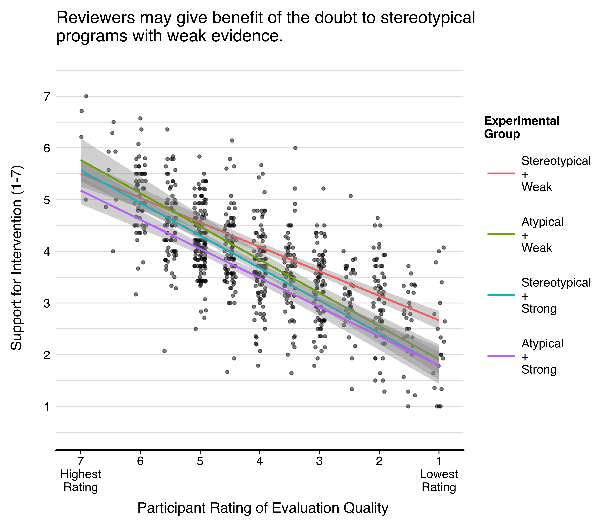
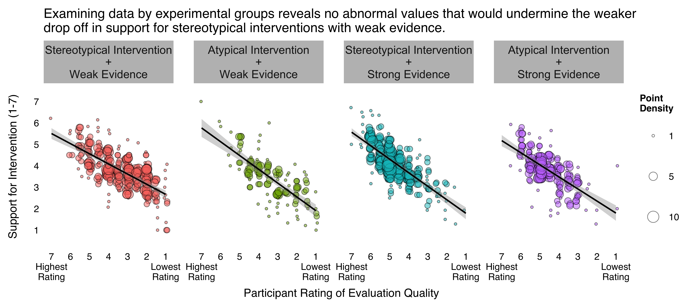

Evidence and Intuition
================
Joseph T. Powers
July 7, 2017

A problem that I tackled in my research is the lackluster support for evidence-based interventions in education.

I often observed that programs that match policy-makers' intuitions about how school should look receive more support for implementation than programs with strong evidence that don't resemble policy-makers' expectations and intuitions.

So the first step in this program was to document empirically whether such a bias against atypical educational interventions existed.

And I did this in a two-by-two experiment. And I explored three explanations and solutions for the bias against atypical programs in education:

1.  Lack of training
2.  Threat to career/identity
3.  Stereotypical thinking (i.e., heuristics)

Support for Different Types of Interventions
--------------------------------------------

#### Policy makers are basing their support for educational programs on evidence quality and educational stereotypes to almost the same degree.

<?xml version="1.0" encoding="UTF-8"?>
<table class="table" style="margin-left: auto; margin-right: auto;">
<thead>
<tr>
<th style="text-align:right;">
Parameter
</th>
<th style="text-align:right;">
Estimate
</th>
<th style="text-align:right;">
SE
</th>
<th style="text-align:right;">
*t*
</th>
<th style="text-align:right;">
95% CI
</th>
</tr>
</thead>
<tbody>
<tr>
<td style="text-align:right;">
Intercept
</td>
<td style="text-align:right;">
3.78
</td>
<td style="text-align:right;">
0.06
</td>
<td style="text-align:right;">
68.42
</td>
<td style="text-align:right;">
\[3.66, 3.89\]
</td>
</tr>
<tr>
<td style="text-align:right;">
Evidence Quality (Contrast)
</td>
<td style="text-align:right;">
0.18
</td>
<td style="text-align:right;">
0.04
</td>
<td style="text-align:right;">
4.77
</td>
<td style="text-align:right;">
\[0.11, 0.25\]
</td>
</tr>
<tr>
<td style="text-align:right;">
Stereotypicality (Contrast)
</td>
<td style="text-align:right;">
0.15
</td>
<td style="text-align:right;">
0.04
</td>
<td style="text-align:right;">
4.04
</td>
<td style="text-align:right;">
\[0.10, 0.24\]
</td>
</tr>
<tr>
<td style="text-align:right;">
Evidence Quality (Contrast) x Stereotypicality (Contrast)
</td>
<td style="text-align:right;">
-0.01
</td>
<td style="text-align:right;">
0.04
</td>
<td style="text-align:right;">
-0.37
</td>
<td style="text-align:right;">
\[-0.09, 0.05\]
</td>
</tr>
</tbody>
</table>
Mean(SD) of Support = 3.84(0.98)

Grant Funding for School Interventions
--------------------------------------

These effects even hold up when we look at grant funding: 
<?xml version="1.0" encoding="UTF-8"?>
<table class="table" style="margin-left: auto; margin-right: auto;">
<thead>
<tr>
<th style="text-align:right;">
Parameter
</th>
<th style="text-align:right;">
Estimate
</th>
<th style="text-align:right;">
SE
</th>
<th style="text-align:right;">
*t*
</th>
<th style="text-align:right;">
95% CI
</th>
</tr>
</thead>
<tbody>
<tr>
<td style="text-align:right;">
Intercept
</td>
<td style="text-align:right;">
3.18
</td>
<td style="text-align:right;">
0.05
</td>
<td style="text-align:right;">
63.61
</td>
<td style="text-align:right;">
\[3.07, 3.28\]
</td>
</tr>
<tr>
<td style="text-align:right;">
Evidence Quality (Contrast)
</td>
<td style="text-align:right;">
0.13
</td>
<td style="text-align:right;">
0.03
</td>
<td style="text-align:right;">
3.99
</td>
<td style="text-align:right;">
\[0.08, 0.20\]
</td>
</tr>
<tr>
<td style="text-align:right;">
Stereotypicality (Contrast)
</td>
<td style="text-align:right;">
0.11
</td>
<td style="text-align:right;">
0.03
</td>
<td style="text-align:right;">
3.46
</td>
<td style="text-align:right;">
\[0.06, 0.18\]
</td>
</tr>
<tr>
<td style="text-align:right;">
Evidence Quality (Contrast) x Stereotypicality (Contrast)
</td>
<td style="text-align:right;">
0.01
</td>
<td style="text-align:right;">
0.03
</td>
<td style="text-align:right;">
0.18
</td>
<td style="text-align:right;">
\[-0.06, 0.06\]
</td>
</tr>
</tbody>
</table>
Mean(SD) of Grant Support = 3.21(0.81)

What are possible explanations for this gap in support that migth point toward solutions?
-----------------------------------------------------------------------------------------

### Lack of training in research methods?

#### Breakdown of sample by training levels:

<?xml version="1.0" encoding="UTF-8"?>
<table class="table table-striped" style="width: auto !important; text-align: right;">
<thead>
<tr>
<th style="text-align:right;">
degree\_f
</th>
<th style="text-align:right;">
n
</th>
</tr>
</thead>
<tbody>
<tr>
<td style="text-align:right;">
PhD
</td>
<td style="text-align:right;">
382
</td>
</tr>
<tr>
<td style="text-align:right;">
EdD
</td>
<td style="text-align:right;">
63
</td>
</tr>
<tr>
<td style="text-align:right;">
MDorJD
</td>
<td style="text-align:right;">
7
</td>
</tr>
<tr>
<td style="text-align:right;">
MA
</td>
<td style="text-align:right;">
242
</td>
</tr>
<tr>
<td style="text-align:right;">
BA
</td>
<td style="text-align:right;">
42
</td>
</tr>
<tr>
<td style="text-align:right;">
NA
</td>
<td style="text-align:right;">
139
</td>
</tr>
</tbody>
</table>
##### Condensed breakdown by training levels:

<?xml version="1.0" encoding="UTF-8"?>
<table class="table table-striped" style="width: auto !important; text-align: right;">
<thead>
<tr>
<th style="text-align:right;">
degree\_f
</th>
<th style="text-align:right;">
n
</th>
</tr>
</thead>
<tbody>
<tr>
<td style="text-align:right;">
PhD
</td>
<td style="text-align:right;">
445
</td>
</tr>
<tr>
<td style="text-align:right;">
MA
</td>
<td style="text-align:right;">
249
</td>
</tr>
<tr>
<td style="text-align:right;">
BA
</td>
<td style="text-align:right;">
42
</td>
</tr>
</tbody>
</table>

<?xml version="1.0" encoding="UTF-8"?>
<table class="table table-striped" style="width: auto !important; text-align: right;">
<thead>
<tr>
<th style="text-align:right;">
degree\_f
</th>
<th style="text-align:right;">
n
</th>
</tr>
</thead>
<tbody>
<tr>
<td style="text-align:right;">
PhD
</td>
<td style="text-align:right;">
445
</td>
</tr>
<tr>
<td style="text-align:right;">
MA
</td>
<td style="text-align:right;">
249
</td>
</tr>
<tr>
<td style="text-align:right;">
NA
</td>
<td style="text-align:right;">
181
</td>
</tr>
</tbody>
</table>
#### Phd Subsample (N = 382)

<?xml version="1.0" encoding="UTF-8"?>
<table class="table" style="margin-left: auto; margin-right: auto;">
<thead>
<tr>
<th style="text-align:right;">
Parameter
</th>
<th style="text-align:right;">
Estimate
</th>
<th style="text-align:right;">
SE
</th>
<th style="text-align:right;">
*t*
</th>
<th style="text-align:right;">
95% CI
</th>
</tr>
</thead>
<tbody>
<tr>
<td style="text-align:right;">
Intercept
</td>
<td style="text-align:right;">
3.73
</td>
<td style="text-align:right;">
0.05
</td>
<td style="text-align:right;">
70.70
</td>
<td style="text-align:right;">
\[3.62, 3.84\]
</td>
</tr>
<tr>
<td style="text-align:right;">
Evidence Quality (Contrast)
</td>
<td style="text-align:right;">
0.23
</td>
<td style="text-align:right;">
0.05
</td>
<td style="text-align:right;">
4.38
</td>
<td style="text-align:right;">
\[0.13, 0.33\]
</td>
</tr>
<tr>
<td style="text-align:right;">
Stereotypicality (Contrast)
</td>
<td style="text-align:right;">
0.16
</td>
<td style="text-align:right;">
0.05
</td>
<td style="text-align:right;">
2.98
</td>
<td style="text-align:right;">
\[0.05, 0.26\]
</td>
</tr>
<tr>
<td style="text-align:right;">
Evidence Quality (Contrast) x Stereotypicality (Contrast)
</td>
<td style="text-align:right;">
-0.06
</td>
<td style="text-align:right;">
0.05
</td>
<td style="text-align:right;">
-1.21
</td>
<td style="text-align:right;">
\[-0.17, 0.04\]
</td>
</tr>
</tbody>
</table>
#### Master's (MA) subsample (N = 242)

<?xml version="1.0" encoding="UTF-8"?>
<table class="table" style="margin-left: auto; margin-right: auto;">
<thead>
<tr>
<th style="text-align:right;">
Parameter
</th>
<th style="text-align:right;">
Estimate
</th>
<th style="text-align:right;">
SE
</th>
<th style="text-align:right;">
*t*
</th>
<th style="text-align:right;">
95% CI
</th>
</tr>
</thead>
<tbody>
<tr>
<td style="text-align:right;">
Intercept
</td>
<td style="text-align:right;">
3.77
</td>
<td style="text-align:right;">
0.06
</td>
<td style="text-align:right;">
62.38
</td>
<td style="text-align:right;">
\[3.65, 3.89\]
</td>
</tr>
<tr>
<td style="text-align:right;">
Evidence Quality (Contrast)
</td>
<td style="text-align:right;">
0.17
</td>
<td style="text-align:right;">
0.06
</td>
<td style="text-align:right;">
2.89
</td>
<td style="text-align:right;">
\[0.06, 0.29\]
</td>
</tr>
<tr>
<td style="text-align:right;">
Stereotypicality (Contrast)
</td>
<td style="text-align:right;">
0.21
</td>
<td style="text-align:right;">
0.06
</td>
<td style="text-align:right;">
3.43
</td>
<td style="text-align:right;">
\[0.09, 0.32\]
</td>
</tr>
<tr>
<td style="text-align:right;">
Evidence Quality (Contrast) x Stereotypicality (Contrast)
</td>
<td style="text-align:right;">
0.00
</td>
<td style="text-align:right;">
0.06
</td>
<td style="text-align:right;">
0.03
</td>
<td style="text-align:right;">
\[-0.12, 0.12\]
</td>
</tr>
</tbody>
</table>
#### Qualitative vs. Quantitative Training?

<?xml version="1.0" encoding="UTF-8"?>
<table class="table table-striped" style="width: auto !important; text-align: right;">
<thead>
<tr>
<th style="text-align:right;">
QualQuant\_f
</th>
<th style="text-align:right;">
n
</th>
</tr>
</thead>
<tbody>
<tr>
<td style="text-align:right;">
Qual
</td>
<td style="text-align:right;">
178
</td>
</tr>
<tr>
<td style="text-align:right;">
Quant
</td>
<td style="text-align:right;">
151
</td>
</tr>
<tr>
<td style="text-align:right;">
NA
</td>
<td style="text-align:right;">
116
</td>
</tr>
</tbody>
</table>
The only insight from exploring Qual vs. Quant distinction among PhDs is that Quants differ in heavily penalizing the atypical program with weak evidence, but are otherwise unmoved by evidence, surprisingly.

So regardless of having a master's or phd in quantitative or qualitative methods people still show similar levels of bias to the full sample, which would suggest that a lack of education or training is not the problem.

Might new atypical approaches represent a threat to the careers/identities of established researchers?
------------------------------------------------------------------------------------------------------

If so then we would expect to see biased evaluation of evidence supporting threatening findings.

<?xml version="1.0" encoding="UTF-8"?>
<table class="table" style="margin-left: auto; margin-right: auto;">
<thead>
<tr>
<th style="text-align:right;">
Parameter
</th>
<th style="text-align:right;">
Estimate
</th>
<th style="text-align:right;">
SE
</th>
<th style="text-align:right;">
*t*
</th>
<th style="text-align:right;">
95% CI
</th>
</tr>
</thead>
<tbody>
<tr>
<td style="text-align:right;">
Intercept
</td>
<td style="text-align:right;">
3.98
</td>
<td style="text-align:right;">
0.05
</td>
<td style="text-align:right;">
87.98
</td>
<td style="text-align:right;">
\[3.89, 4.07\]
</td>
</tr>
<tr>
<td style="text-align:right;">
Evidence Quality (Contrast)
</td>
<td style="text-align:right;">
0.62
</td>
<td style="text-align:right;">
0.05
</td>
<td style="text-align:right;">
13.80
</td>
<td style="text-align:right;">
\[0.54, 0.71\]
</td>
</tr>
<tr>
<td style="text-align:right;">
Stereotypicality (Contrast)
</td>
<td style="text-align:right;">
0.05
</td>
<td style="text-align:right;">
0.05
</td>
<td style="text-align:right;">
1.05
</td>
<td style="text-align:right;">
\[-0.04, 0.14\]
</td>
</tr>
<tr>
<td style="text-align:right;">
Evidence Quality (Contrast) x Stereotypicality (Contrast)
</td>
<td style="text-align:right;">
0.03
</td>
<td style="text-align:right;">
0.05
</td>
<td style="text-align:right;">
0.57
</td>
<td style="text-align:right;">
\[-0.06, 0.11\]
</td>
</tr>
</tbody>
</table>
### Perhaps reviewers weight the same evidence differently when determining their actual support?

Experimental methods targeting bias against atypical school interventions:
--------------------------------------------------------------------------

Both the precommitment and teacher-retraining conditions represent significant improvements above baseline, *t*(145.69) = 2.24, *p*= 0.026 and *t*(88.31) = 2.09, *p*= 0.040, respectively.
